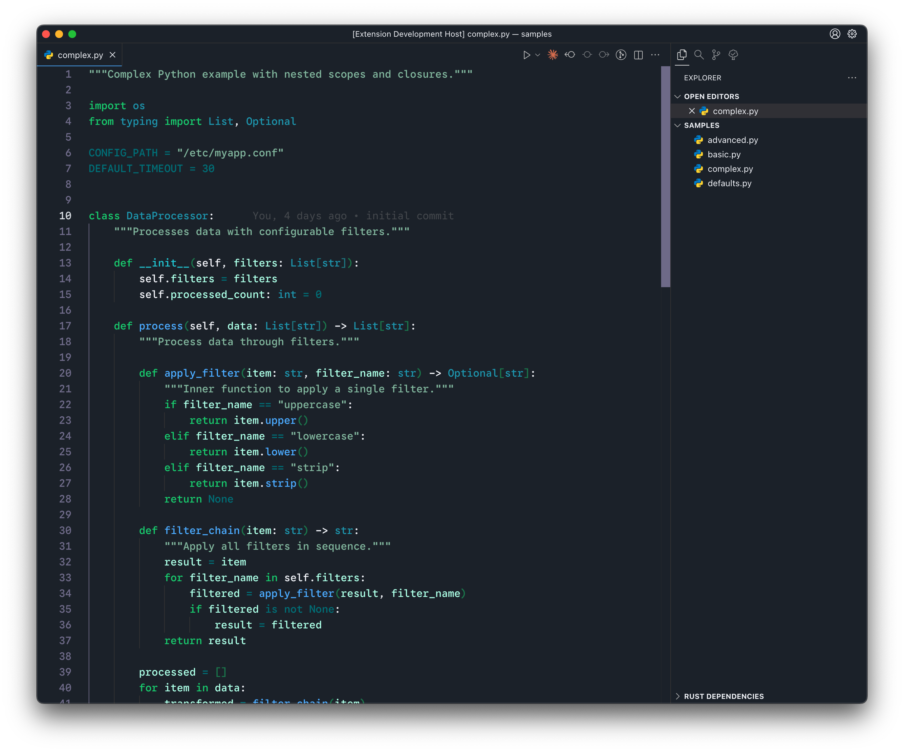
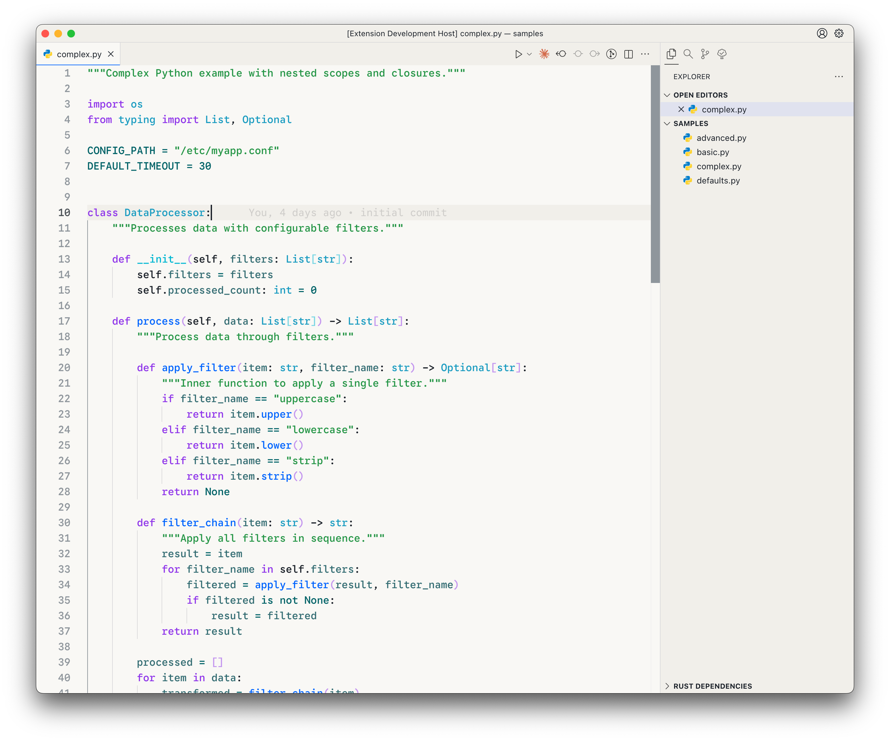

# Verdant Dawn & Dusk

A minty green pair of color themes.





## Palettes

### Dark


```yml
system: "base16"
name: "Verdant Dusk"
author: "https://github.com/desertthunder"
variant: "dark"
palette:
  base00: "#1D242E"
  base01: "#1D242E"
  base02: "#393939"
  base03: "#797593"
  base04: "#dde1e6"
  base05: "#f2f4f8"
  base06: "#ffffff"
  base07: "#E0E0E0"
  base08: "#B5FFE9"
  base09: "#007981"
  base0A: "#209fb5"
  base0B: "#8CBEA7"
  base0C: "#25CDD8"
  base0D: "#55b4ff"
  base0E: "#1AD178"
  base0F: "#1AD178"

```

### Light


```yml
system: "base16"
name: "Verdant Dawn"
author: "https://github.com/desertthunder"
variant: "light"
palette:
  base00: "#FAF9F6"
  base01: "#F3F1ED"
  base02: "#E0E0E0"
  base03: "#9AA0A6"
  base04: "#555B61"
  base05: "#1D242E"
  base06: "#101419"
  base07: "#000000"
  base08: "#3C787E"
  base09: "#006D72"
  base0A: "#1EA6C8"
  base0B: "#2BA050"
  base0C: "#00BFD8"
  base0D: "#006FFF"
  base0E: "#9B3FED"
  base0F: "#C8409D"
```

Made by [Owais](https://github.com/desertthunder). Support my work on [Ko-fi](https://ko-fi.com/desertthunder).

[](https://brainmade.org)
